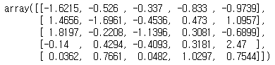
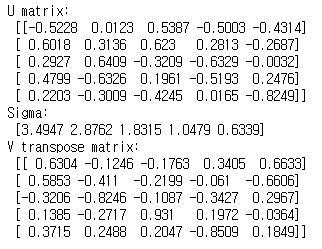
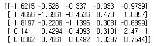

---

# SVD (Singular Vector Decomposition)

> Decomposition
---


= Left Singular Vector (Eigendecompotision of

)

 = Right Singular Vector (Eigendecomposition of 

)


> Pytorch Implementation
---

Let's see it actually works anyway, here's a 5X5 matrix.
```python
import numpy as np
from numpy.linalg import svd

a = np.random.rand(5, 5)
np.round(a, 4)
U, Sigma, V = np.linalg.svd(a)
```
<p align="center">
  
</p>
```python
U, Sigma, V = svd(a)
```

```python
print('U matrix : ', np,round(U, 4))
print('Sigma : ', np,round(Sigma, 4))
print('V transpose matrix : ', np,round(V, 4))
```
<p align="center">
  
</p>
```python
Sigma_mat = np.diag(Sigma)
a_reconstructed = np.matmul(np.matmul(U, Sigma), V)
print(a_reconstructed)
```
<p align="center">
  
</p>

good <br>
and it's `one line code` let's see

[Google](https://google.com)


Below is APPLE crow

[](https://apple.com)
