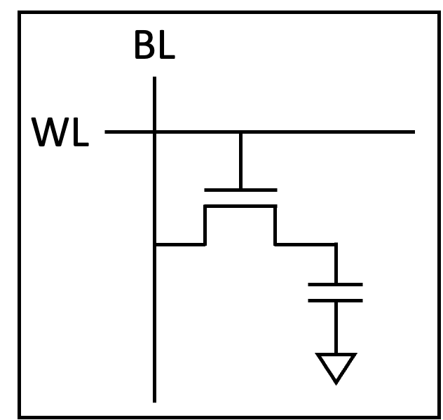
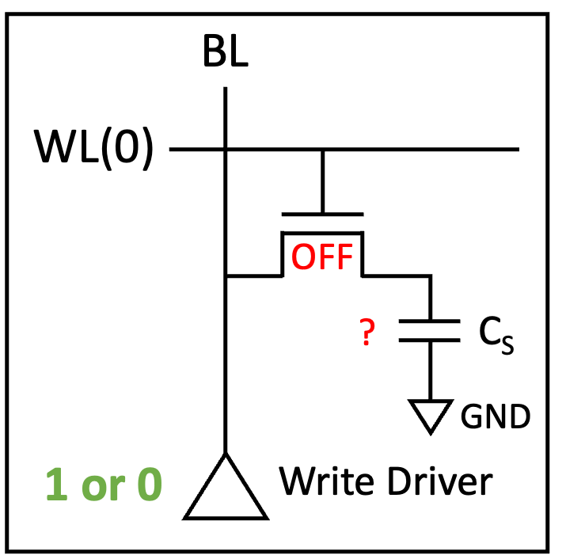
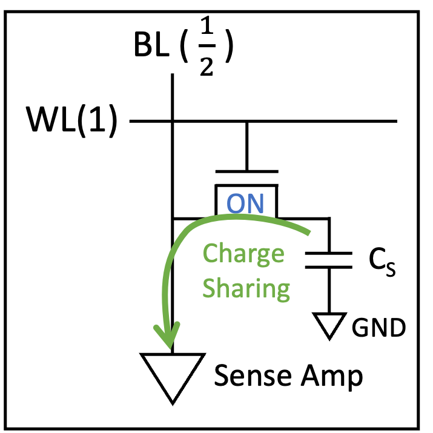
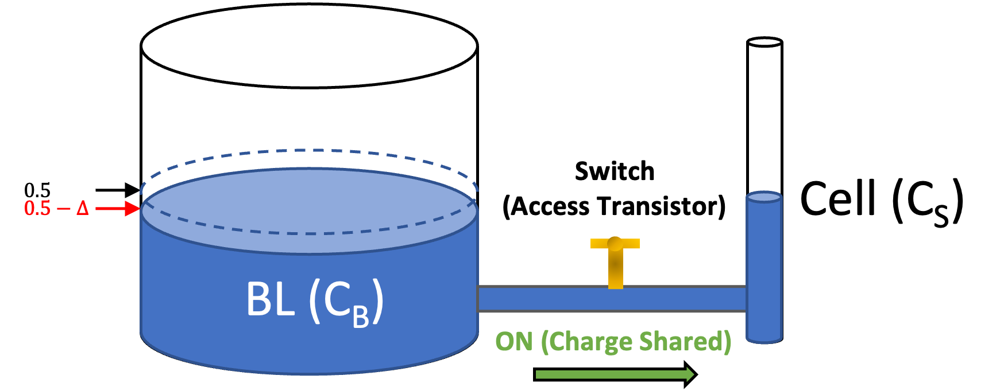
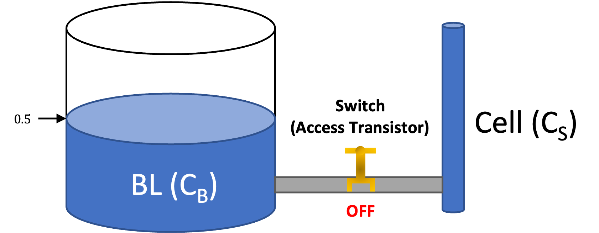
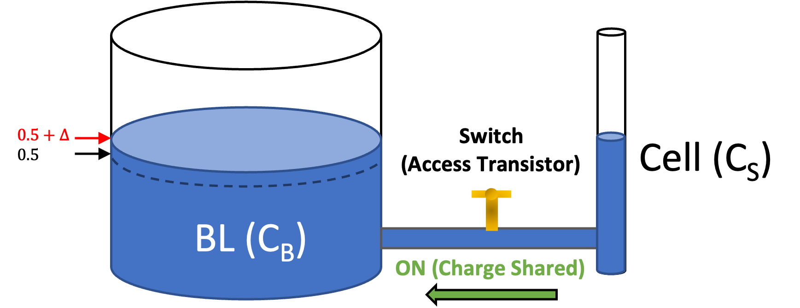

	
---

# DRAM
# (Dynamic Random Access Memory)
is most widely used as a main memory these days.
With a tremendous development of semiconductor industry, the performance of DRAM has been increasing. (There's always been people who thought it's close to the end tho)
How has it been possible to constantly increase the performance?

Well, I guess we first should dive into what DRAM looks like inside and see how it operates.

> DRAM Device Configuration
---

I drew a "simplified" (plz not be offended by undetailed illustration) version of overall DRAM structure here.
It's one of DDR3 architectures (among several SPECs of DDR3), and now we're about to have DDR5, then why DDR3?

DDR4 and DDR5 have been released by addressing some shortcomings of their previous models, let alone improving the performance. 
The thing is that nowadays DRAMs run with a combination of thousands techniques, not a single operation principle due to a lot of development that's been stacked.
Before deeply delving into a recent DRAM architecture, first looking into DDR3 (or DDR2, DDR1) that has a basic structure would be a good idea to understand "How DRAM operates". 

Messy! Start with the basic (the smallest) part, __DRAM cell__.

> DRAM Cell
---

This is a basic DRAM Cell (1T1C : 1 transistor & 1 capacitor). Wait here, the basic implies that there're also different cell structures like 3T1C, so you can search for them ~~or just click the link here [3T1C DRAM Cell.](https://google.com)~~
Generally memory cell stores data as 1 or 0. 
In DRAM cell, the capacitor store the data and the NMOS transistor swtich the capacitor with Bit Line (BL), now we call it access transistor. 
As the gate of the access transistor is connected with Word Line (WL), we can see that it's controlled by WL.

Let me explain how it operates Read / Write command.

> DRAM Cell Write Operation
---

Look at the figure below.
As WL has voltage 0, the access transistor is turned off.
Whatever the capacitor stores, it doesn't matter because we're goind to write a certain data.
For writing data, there's strong Write Driver somewhere at the bottom.

If we increase the voltage of WL, the access transistor is turned on.
As the capacitor is now connected to the BL, Write Driver flows the charge all the way to the capacitor.

No matter which value the capacitor held, capacitor would have the same data with the Write Driver.
And then close the Access Transistor again. 
Wow we just wrote the data into the DRAM Cell.

> DRAM Cell Read Operation
---

Read operation is a bit complicated but still simple.
Here's we have a capacitor which stores the data with the access transistor off.
Before we open the transistor, we "precharge" the BL with 1/2 voltage.

And then, by opening the access transistor, we let the capacitor and BL charge-share.
Since we set the BL with 1/2, we can see the direction BL voltage varies depending on the stored data.

For example, assume that we have 0 data which is empty,
sharing charge is just like sharing the water between 2 different size of bottles of water.
When we consider the overll DRAM cell array, BL is quite lengthy. 
That leads to have a lot of parasite cap, so the charge is larger than a DRAM cell can have.

Next, turn the switch on? Water flows into the cell resulting in a little lower surface level.

In the same manner, we can think of the 1-data case but the different direction of flow.
Firstly, precharge the BL with the access transistor off.

Charge sharing occurred as we open the access transistor.

You might remeber that there's sense amplifer at the bottom of read operation figure.
Since the difference is so small, we have to amplify it so that we make use it as 1 or 0.
That's what sense amplify does and the data resides in the buffer somewhere below.

