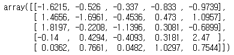
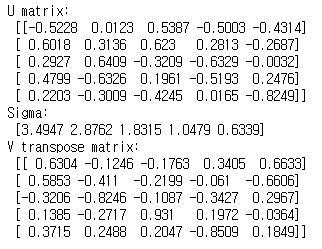
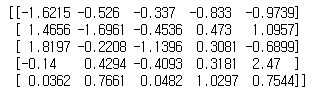
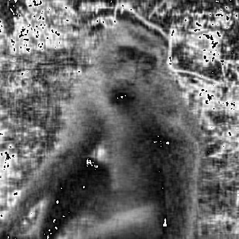
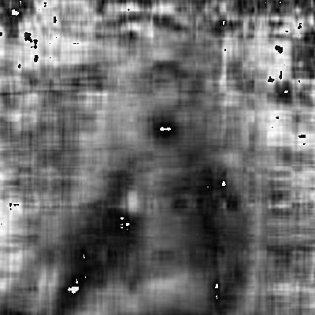

---

# Decomposition of Matrix

Here **[Eigendecomsition](https://en.wikipedia.org/wiki/Eigendecomposition_of_a_matrix)** is a great source explaining essential definitions to know SVD better.
SVD is one of the model compression techniques that mostly used in AI field along with quantization, pruning, knowledge distillation, etc.
If you're interested in that, I recommend reading some survey or review papers such as 

- [Deng, Lei, et al. "Model compression and hardware acceleration for neural networks: A comprehensive survey."](https://ieeexplore.ieee.org/abstract/document/9043731)
- ["Choudhary, Tejalal, et al. "A comprehensive survey on model compression and acceleration."](https://link.springer.com/article/10.1007/s10462-020-09816-7)

> SVD (Singular Vector Decomposition)
---


= Left Singular Vector (Eigendecomposition of

)  

 = Right Singular Vector (Eigendecomposition of 

)  

= Singular Values (Square root of Eigenvalues of

or

)

It can be a bit counterintuitive, so let's get right into the proof.


> Proof SVD
---

We have a matrix 


First, 

is symmetric and positive semidefinite.

---
The symmetricity : 


The positive semidefinite : 


---

Therefore,

by the spectral theorem.


Here, orthonormal vector v is an eigenvector corresponding the sigma value.


---

Now we define a new vector

,that is orthonormal vector due to


Recall 

and multiply the matrix A to it.


Here, orthonormal vector u is an eigenvector corresponding the sigma value.


tells us that the magnitued(sigma) of u and v are the same.

---

Last part, from the definition of the vector u,  


By expanding it to their corresponding dimension, we have


Sigma is diagonal matrix, which is filled with r (ranks) eigenvalues on the diagonal, otherwise 0s.

Since V is a orthonormal matrix, we can rewrite


> Python Implementation
---

Let's see it actually works anyway, here's a 5x5 matrix.
For simplicity, round it to the fourth digit after the decimal point.
```python
import numpy as np
from numpy.linalg import svd

a = np.random.rand(5, 5)
np.round(a, 4)
U, Sigma, V = np.linalg.svd(a)
```

<center>[Implementation Result]</center>
<p align="center">
  
</p>

And then, we can get its SVD matrices using numpy function below.
```python
U, Sigma, V = svd(a)
```

See the values with the same rounding and you can calculate them yourself if you don't trust the code.
```python
print('U matrix : ', np.round(U, 4))
print('Sigma : ', np.round(Sigma, 4))
print('V transpose matrix : ', np.round(V, 4))
```
<center>[Implementation Result]</center>
<p align="center">
  
</p>

`Sigma` here is a vector unit and values inside (singular values) are mostly sorted in descending order.
Since we have 5 values, it's "5-Rank".
For matrix multiplcation, convert `Sigma` into matrix form to reconstruct the original matrix `a`.
```python
Sigma_mat = np.diag(Sigma)
a_reconstructed = np.matmul(np.matmul(U, Sigma), V)
print(a_reconstructed)
```
<center>[Implementation Result]</center>
<p align="center">
  
</p>


> Application on Image
---

As we use the whole (all ranks) singular values, we can fully reconstruct the original matrix, that's called full SVD.
Depending on the number of ranks to be used, it's also called thin, compact and truncated SVD.
Because of the descending order, the last few values are likely to have little significance on the reconstruction.
In other words, we can selectively use the multiple largest values to reconstruct with small information loss..
Here's an example, we have 400x400 image on a greyscale of 0 ~ 255 (8-bit).

<center>[Original Image]</center>
<p align="center">
  
</p>

Below are "100-rank" and "50-rank" reconstrction images of the original, we can see the most of the information is reserved. 
<center>[100 Rank]</center>
<p align="center">
  
</p>

<center>[50 Rank]</center>
<p align="center">
  
</p>
---
Still, we can somehow tell what the object in the photo is.
Now it's getting hard to tell whether it's monkey or human.
And it's obvious that there's some significant loss of information.

<center>[30 Rank]</center>
<p align="center">
  
</p>

In "10 Rank", we barely see the contour of the object, or might not know if there's an object.

<center>[10 Rank]</center>
<p align="center">
  
</p>

---
Then, how much has the data been compressed?
We can manually choose the number of rank using this trade-off.
Inside the sum-of-products of SVD indicates U, sigma and V respectively.

| # of Rank |    Required data (# of 8-bit)   | Compression rate |
|:---------:|:-------------------------------:|:----------------:|
|  Original |         400x400 = 160000        |         -        |
|  100 Rank | 400x100 + 100 + 100x400 = 80100 |      50.01%      |
|  50 Rank  |   400x50 + 50 + 50x400 = 40050  |      25.03%      |
|  30 Rank  |   400x30 + 30 + 30x400 = 24030  |      15.02%      |
|  10 Rank  |   400x10 + 10 + 10x400 = 8010   |       5.01%      |

Aside from this superficial relationship, if we consider the whole computation process of SVD, it might not be a good choice for the actual hardware-implementation.
Specifically, the SVD procedure requires
- <u>Solving polynomial equations</u> for eigenvalues and eigenvectors
- <u>Sorting (or choosing the first 'rank' values)</u> the eigenvalues in descending order
- <u>Rearrange matrices</u> based on the previous information

Therefore, most of AI Accelerator research papers dealing with SVD assume that the procedure is already performed at compile-time or CPU.
When it comes to reconstruction, it is just matrix multiplcation.
So, the reconstruction can be feasibly performed in general MAC (Multiply-and-Accumulate) unit.
