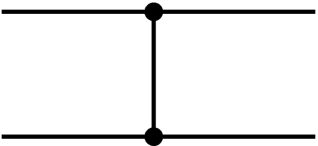
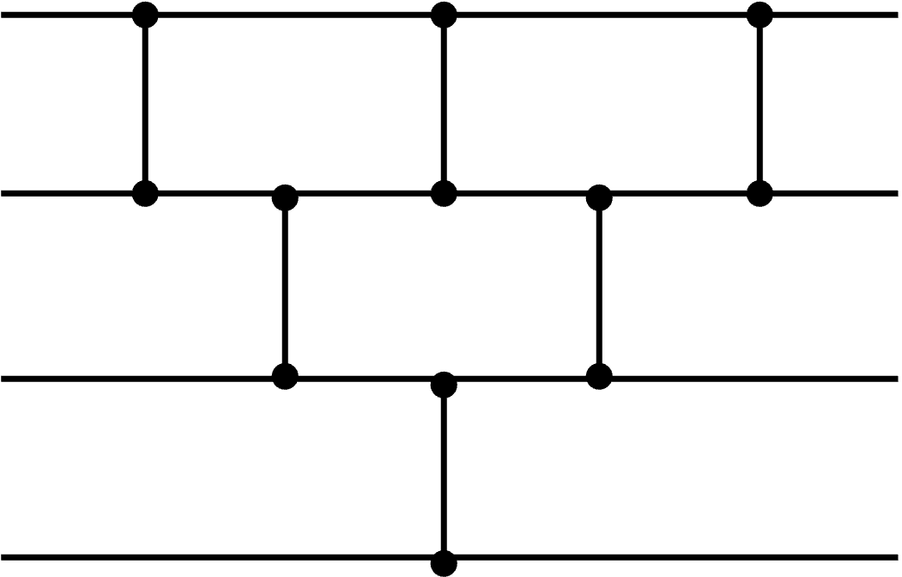
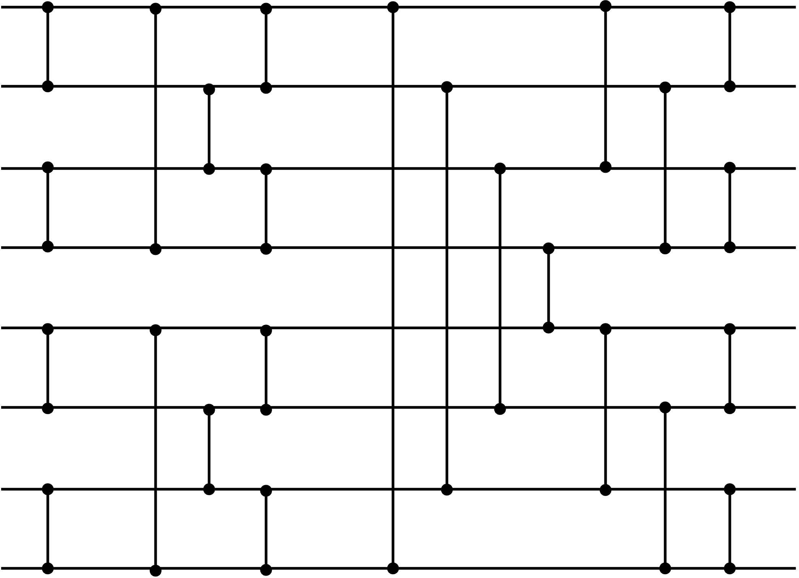

	
---


> Sorting Algorithm
---

There are many ways to sort a list.
For a simple example, we have ___bubble sort___ in the ascending order.

It compares the first element with the next (2nd) element.
If the first element turns out to be larger than the next element, swap them.
And then the second element (whether it's swapped or not) is compared with the next (3rd) element.
If the second elemnt is larger than its next element, swap them.
Iterate the comparison & swap until the last element is compared.
So that we'll certainly have the largest element at the rightmost part in the list.

Next, the same comparison procedure is performed from the first to the second last element.
Then again, we'll get the second largest element at the second rightmost part in the list.
Repeat this whole process until every elements are sorted.

The code would be more intuitive, here's the C++ code.

```cpp
int main(){
    int *list = new int[1,6,8,2,4,5];
    int length = size(list);
	
    for (int i=0; i<length-1; i++){
	for (int j=0; j<length-1-i; j++){
	    if (arr[i] > arr[i+1])
		"swap!"
	}
    }
}
```
However, it's not considered as a fast sorting algorithm since this naive approach has 
 
time complextiy.
This is what it's getting for having a low space complexity,
.

---

Here's another sorting algorithm, ___quick sort___.
As the name implies, generally it's faster than the bubble sort.
Quick sort fisrt set the pivot, and it's usually the first element.
Now every elements are compared to this pivot and moved to the left or right side depending on the comparison result.
It iterates until all elements are sorted, and has

time complexity with

space complexity.

```cpp

void quick_sort(int *list, int start, int end);

int main(){
    int *list = new int[1,6,8,2,4,5];

    quick_sort(list, 0, 6);
}

void quick_sort(int *list, int start, int end){

    if(start == end)
	return;
    
    int pivot = start;
    int left = pivot+1;
    int right = end;

    while (left <= right){
	while (list[left] <= list[pivot])
	    left++;
	while (list[right] <= list[pivot])
	    right--;

	if (left > right)
	    "swap list[right] and list[pivot]!" 
	else
	    "swap list[right] and list[left]!"
    }

    quick_sort(list, start, right-1);
    quick_sort(list, left+1, end);
}
```

Then, how we implement these sorting algorithm with logic circuits?
Well, basically they would be performed in CPU with general ALUs and several registers.
We can't say that these computation units are only for sorting algorithm, though.
However it would be very challenging to make sorting-specialized logic since the length of lists is not fixed and the structure would vary depending on the algorithm.

Therefore, in HW perspective, ___sorting network___ is more suitable for the implementation of logic circuits..

> Sorting Network
---

Let's say that we implement a sorting algorithm with only comparison units and the fixed length of list.
First, below is a basic component that composes a sorting network.
For simplicity, a wire-like bridge that crosses two lines indicates a comparison unit.
The direction of comparator wouldn't matter as long as all the comparators have the same one.

<p align="center">
  
</p>

Next, below is a simple sorting algorithm implementation that receives 4 inputs.

<p align="center">
  
</p>

You might notice that it's a 4-input bubble sort.
Due to its restrictions like fixed length of input, not every sorting algorithm can be efficiently implemented.
Therefore, it has its own optimized method and the most generally used network is called ___sorting network___.

<p align="center">
  
</p>

Although the design might look very random, it has its own stages.
The number of gates (space complexity) is

and the depth (time complexity) is


[This website](http://staff.ustc.edu.cn/~csli/graduate/algorithms/book6/chap28.htm) greatly explains how a sorting network is organized, it's really easy to follow.
